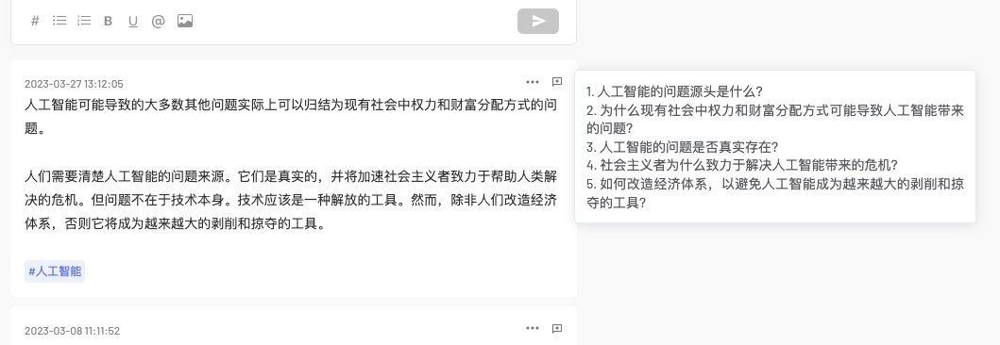

# flomo-review
为 flomo\* 条目增加一个由 chatgpt 提炼的 5 个问题。

\* 仅适配新版（https://v.flomoapp.com/mine）

## 使用
点击扩展图标可以打开配置

|key|value|
|-|-|
|Host|请求的地址|
|Key|密钥|

按要求输入 Openai 的密钥即可。如果使用其它第三方提供的服务，对应更改参数即可。仅使用 gpt-3.5-turbo 模型。
